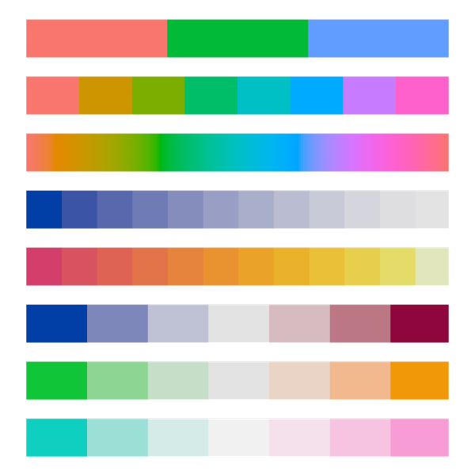

# FsColorSpace
Library for generating color palettes for data visualization. Analogy of R colorspace package.

The standard RGB color space is not suitable for generating perceptually pleasant combinations of colors as it does not allow to vary only hue while keeping saturation and brightness constant. There exist several packages for generating color palettes in R (e.g. colorspace, RColorBrewer, to certain extent also ggplot2) and this library aims to provide similar functionality for F#.

It contains functions for converting CIE LCH color space (where L stands for luminance, C for chroma and H for hue) to RGB and presents several functions for generating qualitative, sequential and diverging color palettes. Default setting for qualitative palettes mimicks R ggplot2 package colors and sequential and diverging palettes correspond to similar functions in R colorspace package.

The library shows several examples, for instance how to reproduce exactly the same palettes as are in article about hcl-colors in R - https://cran.r-project.org/web/packages/colorspace/vignettes/hcl-colors.pdf.

Example of color palettes generated via this library:

